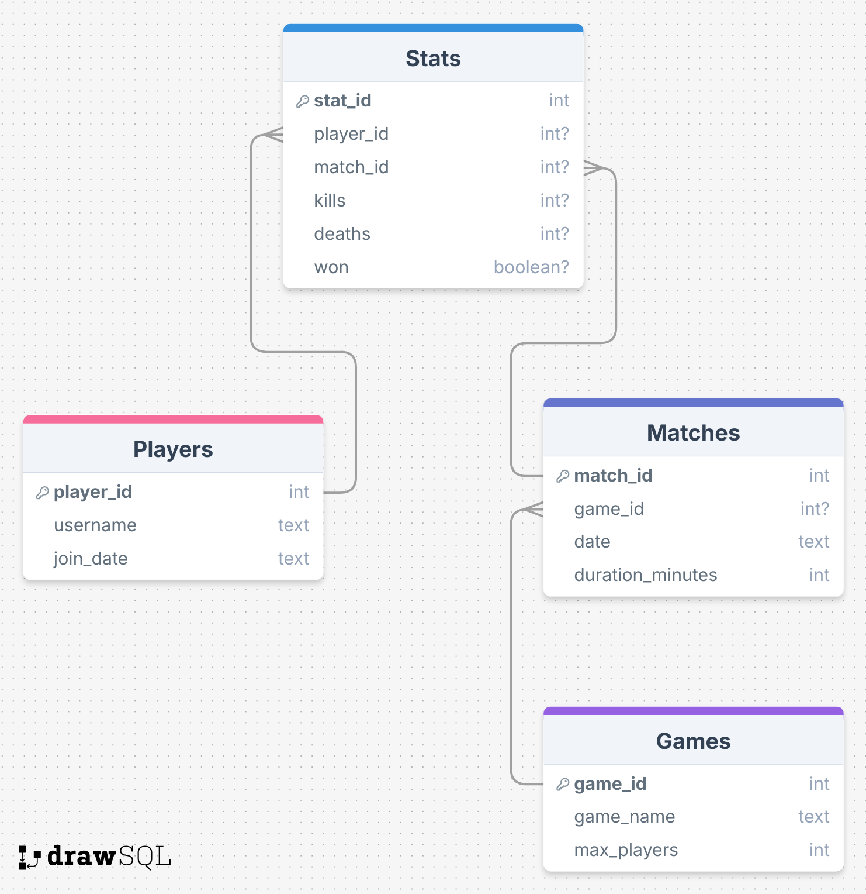

# Minecraft Server „GommeHD.net“ – SQL Übungen

Diese Übungsdatenbank basiert auf dem Aufbau eines Minecraft-Servers. Spieler nehmen an verschiedenen Spielmodi teil, bestreiten Matches und sammeln Statistiken. Ziel ist es, mittels klassischer SQL-Abfragen (Joins über WHERE) Daten auszuwerten.

## Datenbankstruktur

- **Players**: Spielername und Beitrittsdatum
- **Games**: Spielmodi wie BedWars oder SkyWars
- **Matches**: Einzelne Spielrunden (inkl. Datum & Dauer)
- **Stats**: Statistiken (Kills, Tode, Sieg) pro Spieler und Match

---
## 🗺️ Datenbankstruktur

 
 

--aufgabe--

Geben Sie alle Spielernamen mit Beitrittsdatum aus.

--aufgabe--

Zeigen Sie den Namen jedes Spiels und die maximale Spieleranzahl.

--aufgabe--

Geben Sie für jedes Match den Spielernamen und das dazugehörige Spiel aus.

--aufgabe--

Zählen Sie, wie viele Matches jeder Spieler gespielt hat.

--aufgabe--

Berechnen Sie die durchschnittliche Killzahl pro Spieler.

--aufgabe--

Zeigen Sie alle Matches, die von einem Spieler gewonnen wurden – mit Spielernamen und Spielmodus.

--aufgabe--

Finden Sie alle Spieler, die in einem Match mehr Kills als Tode erzielt haben.

--aufgabe--

Berechnen Sie die durchschnittliche Spieldauer pro Spielmodus.

--aufgabe--

Zeigen Sie alle Spieler, die in einem Match mindestens 5 Kills gemacht haben.

--aufgabe--

Zählen Sie, wie viele Spiele jeder Spieler insgesamt gewonnen hat.
