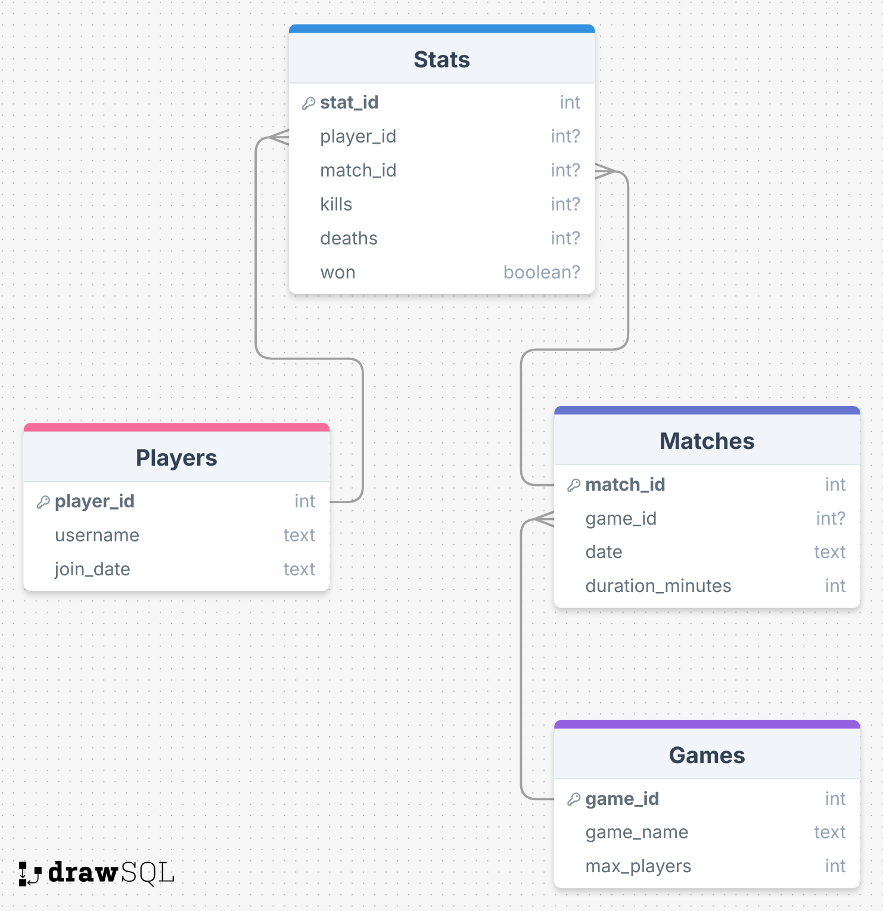

# Minecraft Server „GommeHD.net“ – SQL Übungen

Diese Übungsdatenbank basiert auf dem Aufbau eines Minecraft-Servers. Spieler nehmen an verschiedenen Spielmodi teil, bestreiten Matches und sammeln Statistiken. Ziel ist es, mittels klassischer SQL-Abfragen (Joins über WHERE) Daten auszuwerten.

## Datenbankstruktur

- **Players**: Spielername und Beitrittsdatum
- **Games**: Spielmodi wie BedWars oder SkyWars
- **Matches**: Einzelne Spielrunden (inkl. Datum & Dauer)
- **Stats**: Statistiken (Kills, Tode, Sieg) pro Spieler und Match

---
## 🗺️ Datenbankstruktur

