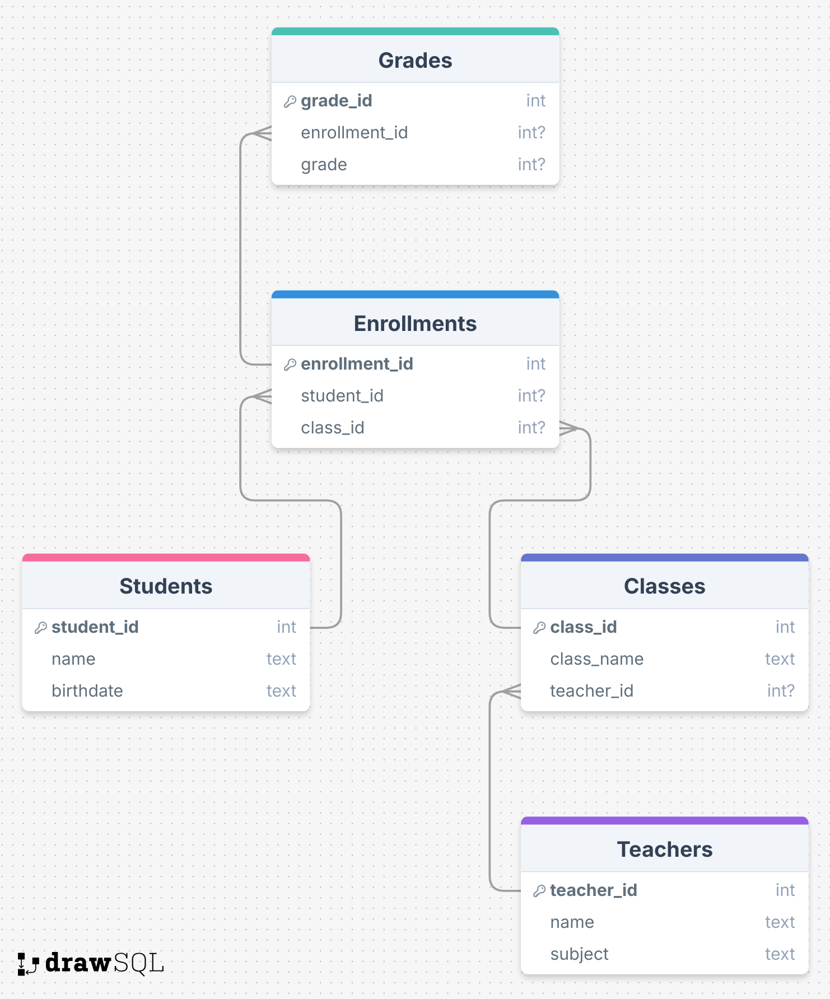

# Schul-Datenbank: SQL-Übungen

Diese Übungsdatenbank simuliert eine einfache Schulverwaltung. Ziel ist es, mit klassischen SQL-Abfragen (über WHERE statt INNER JOIN) wichtige Informationen zu extrahieren. Die Komplexität der Aufgaben steigt mit jeder weiteren Frage.

## Struktur
Die Datenbank enthält folgende Tabellen:

- **Students**: Informationen zu den Schüler:innen
- **Teachers**: Lehrkräfte und ihre Unterrichtsfächer
- **Classes**: Unterrichtsklassen mit jeweiliger Lehrkraft
- **Enrollments**: Anmeldungen von Schüler:innen zu Klassen
- **Grades**: Vergebene Noten zu Anmeldungen

---

## 🗺️ Datenbankstruktur

 
 

--aufgabe--

Geben Sie den Namen und das Geburtsdatum aller Schüler:innen aus.

--aufgabe--

Zeigen Sie den Namen jeder Klasse zusammen mit dem zugehörigen Unterrichtsfach an.

--aufgabe--

Geben Sie alle Schüler:innen mit dem Namen der Klasse aus, in die sie eingeschrieben sind.

--aufgabe--

Zählen Sie, wie viele Schüler:innen in jeder Klasse eingeschrieben sind.

--aufgabe--

Berechnen Sie die durchschnittliche Note für jede:n Schüler:in.

--aufgabe--

Berechnen Sie die durchschnittliche Note für jede Klasse.

--aufgabe--

Zeigen Sie alle Schüler:innen an, die mindestens eine Eins (Note = 1) erhalten haben.

--aufgabe--

Zählen Sie, wie viele Klassen jede Lehrkraft unterrichtet.

--aufgabe--

Geben Sie die Namen aller Schüler:innen aus, die in mindestens einer Klasse eine Note unter 3 erhalten haben. Geben Sie zusätzlich die jeweilige Klasse und Note aus.

--aufgabe--

Zeigen Sie den Namen aller Klassen, die von „Herr Meier“ unterrichtet werden.
