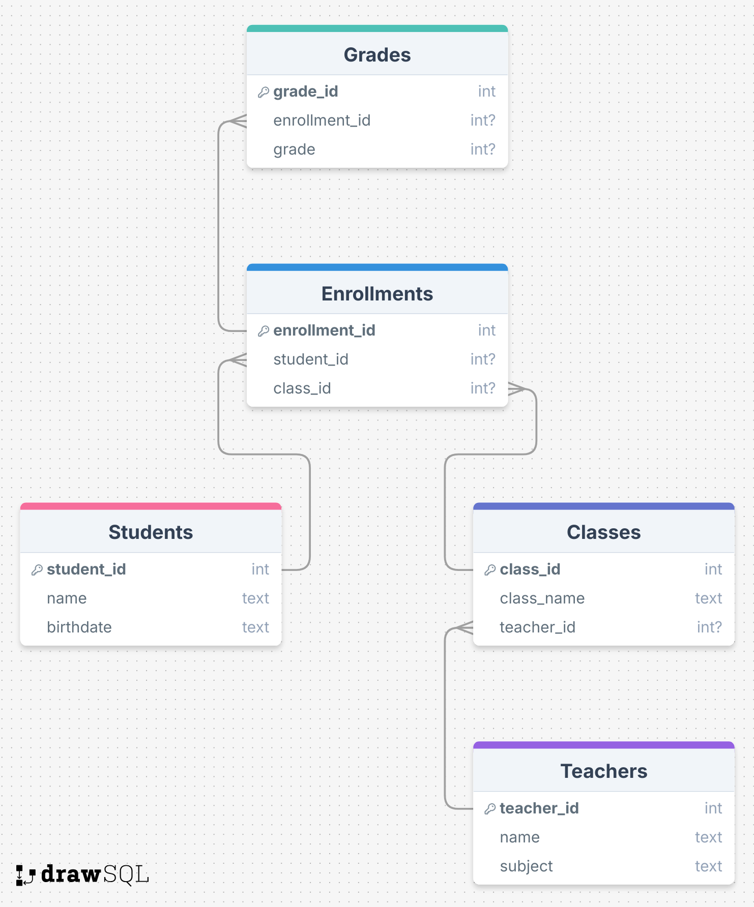

# Schul-Datenbank: SQL-Übungen

Diese Übungsdatenbank simuliert eine einfache Schulverwaltung. Ziel ist es, mit klassischen SQL-Abfragen (über WHERE statt INNER JOIN) wichtige Informationen zu extrahieren. Die Komplexität der Aufgaben steigt mit jeder weiteren Frage.

## Struktur
Die Datenbank enthält folgende Tabellen:

- **Students**: Informationen zu den Schüler:innen
- **Teachers**: Lehrkräfte und ihre Unterrichtsfächer
- **Classes**: Unterrichtsklassen mit jeweiliger Lehrkraft
- **Enrollments**: Anmeldungen von Schüler:innen zu Klassen
- **Grades**: Vergebene Noten zu Anmeldungen

---

## 🗺️ Datenbankstruktur

