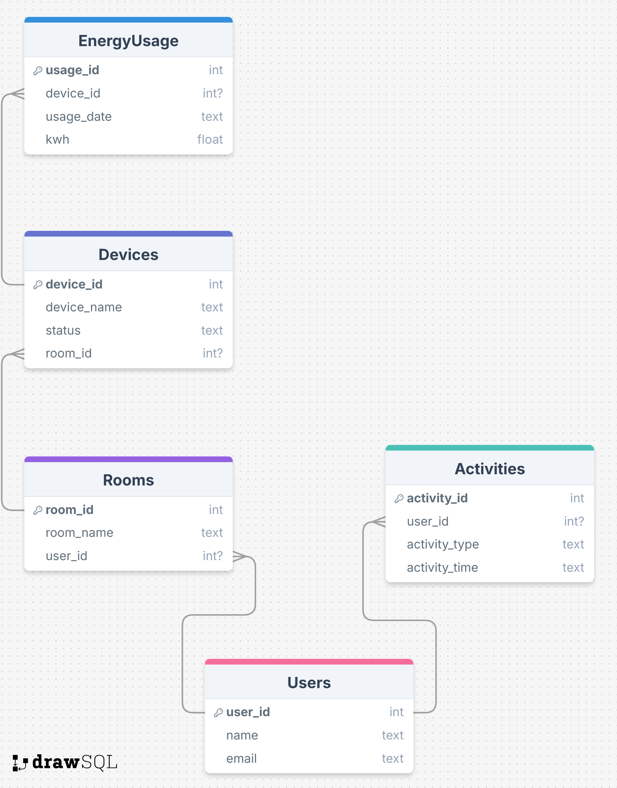

# Smart Home SQL Aufgaben
**!! BEI Fehlern mit der Lösung einfach seite so oft neu laden bis es angezeigt wird !!**

Die folgende Übungsdatenbank bildet ein fiktives **Smart Home System** ab. Sie umfasst mehrere miteinander verknüpfte Tabellen, die verschiedene Aspekte eines intelligent vernetzten Haushalts modellieren. Ziel ist es, durch gezielte SQL-Abfragen ein besseres Verständnis für Datenbankstrukturen, Abfragen und Verknüpfungen zu entwickeln.

## 🏠 Datenbankübersicht

Die Datenbank besteht aus folgenden zentralen Entitäten:

- **Users** – Informationen über die Benutzer des Systems
- **Rooms** – Die einzelnen Räume, die Benutzern zugeordnet sind
- **Devices** – Geräte, die sich in bestimmten Räumen befinden
- **EnergyUsage** – Protokollierter Energieverbrauch einzelner Geräte
- **Activities** – Aktionen, die von Benutzern im System ausgeführt wurden

---

## 🗺️ Datenbankstruktur

 
 

> 🔁 **Hinweis zur Darstellung:**  
> In diesem Diagramm symbolisieren **mehrere Linien (Verzweigungen)** an einem Ende eine **„Viele“-Beziehung (N)**,  
> während eine **einzelne Verbindungslinie** für eine **„Eins“-Beziehung (1)** steht.
>
> Beispiel:  
> Ein Benutzer (1) kann **mehrere Räume (N)** besitzen – dargestellt durch eine einzelne Linie auf der Benutzerseite und mehrere Linien auf der Raumseite.

--aufgabe--

Schreiben Sie ein SQL-Statement, um die Namen und E-Mails aller Benutzer abzurufen.

--aufgabe--

Ermitteln Sie den Raumnamen und die Anzahl der Geräte in jedem Raum. Gruppieren Sie nach Raum.

--aufgabe--

Schreiben Sie eine SQL-Abfrage, die alle Geräte in einem bestimmten Raum (z. B. "Wohnzimmer") auflistet.

--aufgabe--

Berechnen Sie den gesamten Energieverbrauch in Kilowattstunden für jedes Gerät. Gruppieren Sie nach Gerät.

--aufgabe--

Finden Sie den Benutzer, der die meisten Aktivitäten durchgeführt hat.

--aufgabe--

Schreiben Sie eine SQL-Abfrage, die alle Geräte auflistet, die mehr als 10 kWh verbraucht haben. Sortieren Sie die Ergebnisse nach dem höchsten Verbrauch.

--aufgabe--

Zeigen Sie alle Geräte an, deren Status „aus“ ist, und ordnen Sie sie nach Raumnamen.

--aufgabe--

Berechnen Sie den durchschnittlichen Energieverbrauch für alle Geräte im Raum „Wohnzimmer“.

--aufgabe--

Ermitteln Sie die Geräte, die im Jahr 2025 mehr als 50 kWh verbraucht haben und deren Status „ein“ ist. mit `WHERE strftime('%Y', EnergyUsage.usage_date) = '2025'` kann man für 2025 abfragen machen...

--aufgabe--

Schreiben Sie eine SQL-Abfrage, die alle Benutzer auflistet, die mehr als 5 Aktivitäten durchgeführt haben, und die Anzahl der Aktivitäten pro Benutzer anzeigt. Sortieren Sie nach der Anzahl der Aktivitäten in absteigender Reihenfolge.
